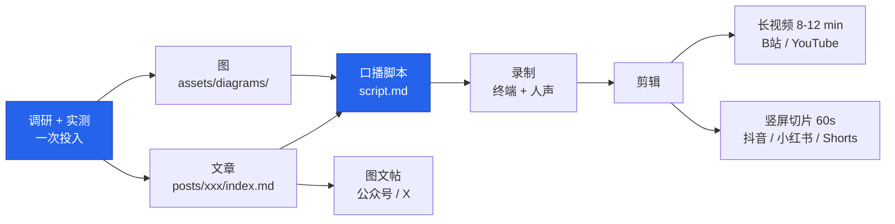
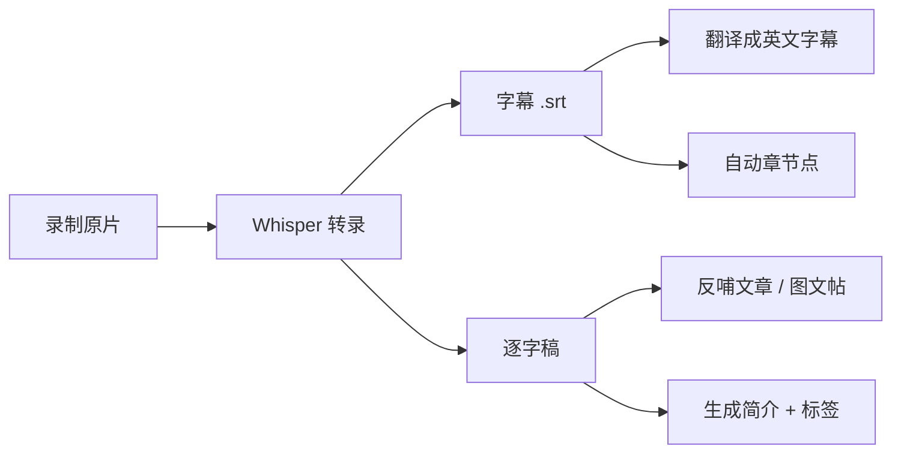

# 视频工作流：把一篇文章变成一条视频

> 最后更新：2026-09-07 ｜ 适用阶段：M2 之后（先有 3-4 篇稳定文章再开视频线）

## 0. 核心原则：文章是母体，视频是派生

**不要为视频单独选题、单独调研。** 那等于把工作量翻倍，一个人扛不住。
正确的做法是**一鱼三吃**：同一份调研 + 同一套图，产出文章、视频、切片三种形态。



**增量成本**：文章已完成的前提下，一条 10 分钟视频约需 **+5 小时**
（脚本 1h、录制 1.5h、剪辑 2h、封面与上传 0.5h）。低于这个数说明质量在打折。

---

## 1. 先决定做哪种视频

| 形态 | 时长 | 适合的内容 | 制作成本 | 建议 |
| --- | --- | --- | --- | --- |
| **A. 竖屏切片** | 30-60s | 一个技巧、一张图、一个反直觉结论 | ★☆☆ | **从这个起步**，试错成本最低 |
| **B. 教程主视频** | 8-12 min | 模块 2/3 的实操类文章 | ★★★ | 专题主力形态 |
| **C. 实录 / 长演示** | 20-40 min | 「用 Agent 从零做一个项目」 | ★★☆ | 剪辑少但录制风险高，M3 再做 |
| **D. 纯屏录无人声** | 2-5 min | 命令行演示 | ★☆☆ | 用 VHS 生成，可当 B 卷素材 |

**起步路线**：先用形态 A 发 5 条，验证选题共鸣和你的口播状态，再上形态 B。
一上来就做 12 分钟教程，大概率半途而废。

---

## 2. 从文章到脚本

文章的书面语**不能直接念**。转换要做三件事：

| 文章 | 脚本 |
| --- | --- |
| 「本文将介绍……」 | 删掉。直接进痛点 |
| 复杂长句、从句嵌套 | 拆成短句，一句一个意思 |
| 「如上表所示」 | 「你看这里」+ 画面切到表 |
| 完整代码块 | 只念关键 2-3 行，其余靠画面 |
| 严谨的限定语 | 保留但后置，别打断节奏 |

### 黄金结构（形态 B）

```
0:00-0:15  钩子    一句话说清痛点，或直接甩结论 —— 这 15 秒决定完播率
0:15-0:45  承诺    看完你能做到什么 + 本视频的 3 个部分
0:45-3:00  机制    为什么会这样（用文章里的机制图，这是差异化）
3:00-8:00  实操    真实终端录屏，边做边说
8:00-9:30  边界    什么时候别这么做（建立可信度的关键段落）
9:30-10:00 收尾    一句话总结 + 下期预告 + 引导到文章全文
```

**每 90 秒必须有一次画面形态切换**（人脸 → 终端 → 图 → 代码），否则观众会划走。

### 脚本模板

见 [`templates/video-script-template.md`](../templates/video-script-template.md)。
核心是一张**分镜表**：时间码 / 画面 / 口播 / 屏幕字 / 素材文件。

---

## 3. 录制

### 3.1 声音优先于画面

**观众能忍受一般的画面，忍不了糟糕的声音。** 预算优先给麦克风。

| 档位 | 麦克风 | 其他 |
| --- | --- | --- |
| 入门 (¥0) | 有线耳机麦 + 安静房间 + 软装吸音 | 手机当录音笔 |
| 推荐 (¥600-1500) | 动圈 USB 麦（Maono/Fifine/舒尔 MV7 级别） | 防喷罩 + 悬臂支架 |
| 进阶 (¥3000+) | 电容麦 + 声卡 | 吸音棉，独立录音轨 |

**动圈优于电容**：家里录音，动圈对环境噪音宽容得多。

### 3.2 终端录制的两条路

| 方式 | 工具 | 特点 |
| --- | --- | --- |
| **可复现脚本** | VHS（`.tape` → GIF/MP4） | 无口播，画面完美，改一行重新生成。**做 B 卷素材首选** |
| **真人实操** | OBS Studio 录屏 | 有真实的等待、报错、修正 —— 这恰恰是可信度来源，别全剪掉 |

**实操录制的强制设置：**

```
终端字号        ≥ 20pt（手机上要能看清，这是竖屏切片的硬门槛）
终端尺寸        1920×1080 或 16:9 裁切区域内
主题            固定一套（建议深色，与图的暗色版一致）
提示符          精简掉 git 分支、路径等长信息，只留 $ 或 ❯
录制分辨率      1920×1080 @ 30fps 足够；60fps 只对滚动动画有意义
```

### 3.3 隐私红线（每次录制前检查）

- [ ] 换到**演示仓库 + 演示账号**，不用真实工作项目
- [ ] 环境变量、`.env`、`~/.claude/settings.json` 里的 token 已清空或打码
- [ ] 关掉所有通知（macOS 专注模式 / Windows 勿扰）
- [ ] 浏览器换到无痕窗口，书签栏隐藏
- [ ] 终端历史 `history -c`，避免误触上翻出敏感命令
- [ ] 录完**倍速通看一遍**，专门找漏出的信息

> 这一条不是形式主义。技术视频泄露 API key 是常见事故，且视频一旦发出就无法真正撤回。

---

## 4. 剪辑

| 工具 | 适合 | 说明 |
| --- | --- | --- |
| **Descript** | 技术口播 | **文字剪辑**：删文字=删画面，自动删「呃/那个」。技术视频效率最高的选择 |
| **DaVinci Resolve** | 长视频精剪 | 免费且专业，调色和音频处理强，学习曲线陡 |
| **剪映 / CapCut** | 竖屏切片 | 自动字幕对中文识别率高，模板多，出片快 |
| **FFmpeg** | 批处理 | 转码、裁切、拼接、压制，写进 Makefile 一键跑 |

### 剪辑三原则

1. **删掉所有等待**。Agent 思考 20 秒 → 加速到 2 秒或跳切，但**留一点**，让观众知道它真的需要时间。
2. **保留一次失败**。全程顺利的演示没有可信度。留一个报错和你怎么修的，这是最有价值的片段。
3. **字幕必须有**。中文视频尤其：大量观众静音观看。关键术语（`CLAUDE.md`、MCP）用屏幕字标出，不要只靠语音。

### 常用 FFmpeg 片段

```bash
# 长视频截一段做竖屏切片：居中裁 9:16 + 缩放
ffmpeg -i long.mp4 -ss 00:03:12 -t 55 \
  -vf "crop=ih*9/16:ih,scale=1080:1920" -c:a copy clip.mp4

# 把 VHS 生成的 GIF 转成可用的 B 卷
ffmpeg -i demo.gif -movflags faststart -pix_fmt yuv420p \
  -vf "scale=trunc(iw/2)*2:trunc(ih/2)*2" demo.mp4

# 音频响度标准化（B站/YouTube 都按 LUFS 判断）
ffmpeg -i in.mp4 -af loudnorm=I=-16:TP=-1.5:LRA=11 -c:v copy out.mp4
```

---

## 5. 自动化（能省一半时间）



- **转录**：`whisper` / `faster-whisper` 本地跑，中文用 `large-v3` 模型。
  ```bash
  whisper input.mp4 --model large-v3 --language zh \
          --output_format srt --output_dir subs/
  ```
- **逐字稿反哺**：录完的逐字稿常常比原文章更口语、更好懂，可以回头改文章。
- **英文字幕**：用 Agent 翻译 `.srt`，但**术语要对照 `docs/03-writing-style.md` 的术语表**，不要让它自由发挥。
- **AI 配音**：可以用，但**只用于切片和 B 卷**。主视频用真人声音 —— 技术内容的信任感很大一部分来自「有个真人在为此背书」。

---

## 6. 视觉素材复用

`assets/diagrams/` 里的图**直接就是视频素材**，只需补一个视频版导出规范：

| 用途 | 尺寸 | 要求 |
| --- | --- | --- |
| 横屏 B 卷 | 1920×1080 | 图周围留 5% 安全边距 |
| 竖屏切片 | 1080×1920 | 图放中间 60% 区域，上下留标题/字幕位 |
| 封面 | 1280×720（YT）/ 1146×717（B站） | 大字 ≤ 10 个，手机缩略图下要能读 |

导出脚本（复用 `02-visual-system.md` 的 Playwright 方案）：

```bash
# 同一份 HTML/SVG 出三种尺寸
for size in "1920x1080" "1080x1920" "1280x720"; do
  node scripts/shoot.mjs assets/diagrams/src/agent-loop.html "$size"
done
```

**图在视频里要动**：静态图停 3 秒观众就走神。最简单的做法是**分步显示** ——
先出左半边，讲到右半边再淡入。Mermaid 图可以导出多个版本（`-step1.svg`、`-step2.svg`）实现。

---

## 7. 发布矩阵

| 平台 | 主形态 | 时长 | 封面 | 标题 | 注意 |
| --- | --- | --- | --- | --- | --- |
| **B站** | 形态 B/C | 8-20 min | 1146×717 | ≤ 40 字 | 主阵地。分区选「科技·计算机技术」；简介放文章链接；三连引导要自然 |
| **YouTube** | 形态 B | 8-15 min | 1280×720 | ≤ 60 字符 | 英文重制版；章节点必加；描述里放时间戳 |
| **抖音 / 快手** | 形态 A | 30-60s | 竖屏首帧 | ≤ 20 字 | 前 3 秒定生死；字幕必须大 |
| **小红书** | 形态 A + 图文 | 30-90s | 竖屏 | 标题+正文 | 技术内容在这里意外地吃香，图文帖转化率高于视频 |
| **X / Shorts** | 形态 A | ≤ 60s | — | — | 英文，配一张图效果最好 |

**发布顺序**：文章先发（沉淀搜索流量）→ 视频后发（简介引流回文章）→ 切片最后发（引流到长视频）。

---

## 8. 目录结构

```
posts/<slug>/
├── index.md              # 文章（母体）
├── video/
│   ├── script.md         # 分镜脚本
│   ├── shotlist.md       # 素材清单（哪些图、哪些 .tape）
│   ├── subs.zh.srt
│   ├── subs.en.srt
│   ├── description.md    # 各平台简介 + 标签
│   └── thumbnail.html    # 封面源文件（HTML → 截图）
└── clips/
    └── clip-01.md        # 每条切片的脚本
```

**原始素材（几十 GB 的录屏）不进 git**，放本地或网盘，在 `shotlist.md` 里记路径。
`.gitignore` 里加 `*.mp4`、`*.mov`、`*.wav`。

---

## 9. 质量门禁

- [ ] 前 15 秒说清了痛点或结论
- [ ] 至少一次真实的失败与修复
- [ ] 每 90 秒有画面形态切换
- [ ] 中文字幕全程，术语与术语表一致
- [ ] 音频已做响度标准化（-16 LUFS）
- [ ] 隐私检查表逐项过（§3.3）
- [ ] 封面在手机缩略图尺寸下能读清
- [ ] 简介里有文章链接和关键时间戳
- [ ] 已剪出至少 1 条竖屏切片
- [ ] 逐字稿已回头检查，看有没有值得补进文章的表达

---

## 10. 常见坑

| ❌ | ✅ |
| --- | --- |
| 为视频单独选题 | 只做已发文章的派生 |
| 追求一镜到底 | 分段录，剪起来更快、心理压力更小 |
| 全程完美演示 | 留一次真实报错 |
| 终端字号照平时设置 | 手机上看不清 = 白做 |
| 先买设备再开始 | 先用耳机麦发 5 条切片，验证了再投入 |
| 视频和文章内容 100% 重合 | 视频多给「过程和手感」，文章多给「细节和链接」 |
| 攒够 10 条再发 | 发一条改一条，前 5 条本来就是练习 |
| 承诺周更然后断更 | 先做「不定期」，形成肌肉记忆再定节奏 |

---

## 11. 落地路线

| 阶段 | 动作 | 完成标志 |
| --- | --- | --- |
| **V0** | 拿一篇已发文章，只做 1 条 60s 竖屏切片，不配人声，用 VHS + 字幕 | 走通导出与上传 |
| **V1** | 同一篇文章做带口播的 8 分钟主视频 | 确认口播状态，沉淀脚本模板 |
| **V2** | 建立「每篇文章 → 1 主视频 + 2 切片」的固定流程 | 增量成本稳定在 5 小时内 |
| **V3** | 上自动化：Whisper 字幕、批量导图、FFmpeg Makefile | 剪辑时间减半 |
| **V4** | 英文版重制，铺 YouTube | — |
