> 适用版本：Claude Code v2.x ｜ 验证日期：2026-09-07
> 想看更深的版本？看这篇的[进阶版](deep-dive.md)。

---

## 只看一句话的话

你给 AI 派活的时候，**在最后加一句：**

```text
做完之后跑一遍 npm test，没过就自己改，改到过为止。
```

就这一句。

省下来的时间，大概是一半。

下面解释为什么。

---

## 先说说你现在是怎么用的

你打开 Claude Code，敲了一句：

```text
把登录模块重构一下
```

然后你就坐在那儿看着。

它读文件、改代码、又读文件。

过了十分钟，它说：**"已完成。"**

---

## 然后你就开始返工了

你打开看看它改了啥。

发现漏了一个地方。

你说："这里不对。"

它说："好的，我改。"

改完你再看。又漏了一个。

你再说。它再改。

半小时过去了。

**你比自己写还累。**

---

## 你有没有发现，一直在检查的人是你？

回头看刚才那个过程。

它改 → **你看** → 你说不对 → 它改 → **你再看** → ……

中间那个"你看"，重复了一遍又一遍。

**这就是你累的原因。**

而这件事，本来不用你干。

---

## 它为什么不自己检查？

因为**你没告诉它什么叫"做完了"**。

它写完代码，看了一眼，觉得"嗯，好像可以了"，就停下来跟你汇报。

它没别的办法。你没给它标准，它只能自己感觉。

**感觉这个东西，你懂的，不太准。**

---

## 想象一下你让人帮你买菜

**第一种说法：**

> "你去买点菜。"

他买回来了。你一看，"哎，没买葱啊。"

他再去。回来了，"番茄怎么是烂的？"

他再去。

**第二种说法：**

> "买番茄、鸡蛋、葱。回来之前对一下这个清单，缺一样就再去补。"

他自己对清单，缺什么自己补，齐了才回来。

**同一个人，同一件事。**

区别只在于：**你有没有给他一张清单。**

---

## 代码这边，清单就是"跑一遍测试"

一模一样的道理。

你多加一句"做完跑一遍测试"，它就会：

自己跑 → 红了 → 自己看报错 → 自己改 → 再跑 → 还红 → 再改 → 绿了 → 才来找你。

中间那些来回，**全是它自己在做**，你根本不知道发生过。



上面那行红的，全是你干的活。

下面那行，你只干最后一格。

---

## 具体怎么写？看这三个例子

### 例子一：让它写个新功能

**以前你这么说：**
```text
实现一个校验邮箱的函数
```

**现在你这么说：**
```text
写一个校验邮箱的函数。
这几种情况要对：a@b.com 算合法，invalid 算不合法，a@.com 算不合法。
写完把测试跑一遍。
```

多打了两行，它自己就会验。

---

### 例子二：让它改页面样式

**以前：**
```text
让这个页面好看点
```

**现在：**
```text
[把设计稿图片拖进来]
照这个设计改。
改完自己截个图，跟设计稿对一下，哪里不一样列出来然后改掉。
```

它真的会截图对比。

---

### 例子三：让它修 bug

**以前：**
```text
构建挂了，修一下
```

**现在：**
```text
构建报了这个错：
[把完整报错贴进来]

修好，然后跑一遍确认能过。
不要用忽略错误的方式糊弄过去，要找到真正的原因。
```

最后那句很重要。

不加的话，它可能会给你加个"忽略这个错误"，**构建是过了，问题还在**。

---

## 不知道怎么写？照着填空

```text
【要它做什么】

【相关代码在哪个文件夹】

做完之后跑 【什么命令】，
【什么情况算通过】。
没过就继续改，直到过为止。
把结果贴给我看。
```

填好长这样：

```text
购物车用优惠券的时候，总价算错了。

代码在 src/cart/ 这个文件夹里。

做完之后跑 npm test，
所有跟购物车相关的测试都要绿。
没过就继续改，直到过为止。
把结果贴给我看。
```

---

## 我的项目没有测试怎么办？

那就退一步，让它跑这两个：

```text
做完之后跑一遍 npm run build 和 npm run lint，确认都不报错。
```

一个是"能不能编译过"，一个是"代码格式和低级错误"。

**比什么都不跑强很多。**

再不济，你也可以说：

```text
做完之后把你改过的每个文件都重新读一遍，
检查有没有漏改的地方。
```

---

## 它说"做完了"，你回一句

```text
把你跑的命令和输出贴出来我看看
```

**不要相信"已完成"这三个字。**

要它拿出东西来。

为什么？因为**你扫一眼输出，比你自己去跑一遍快多了**。

而且如果你刚才走开泡了杯咖啡，回来看一眼输出就知道它靠不靠谱。

---

## 另外三个小动作，也很省事

### 一、发现不对，立刻按 Esc

不要等它跑完。

按 `Esc` 就能打断，前面聊的东西都还在，你直接说"不对，往这边改"就行。

### 二、同一个问题说了两遍还不对，就重开

不要说第三遍。

敲 `/clear`，把之前的对话全清掉，重新描述一遍。

为什么？因为**前面那些失败的尝试，它还记着呢**。

你越纠正，它脑子里的垃圾越多，越容易钻牛角尖。

清空重来，反而快。

### 三、别说"你调研一下"

你说"调研一下我们的权限系统是怎么做的"，它可能会去读几百个文件。

读太多会怎样？它能同时记住的东西是有限的，**读多了就开始忘事、开始胡说**。

换个说法：

```text
我想知道权限校验是在哪里做的。
只看 src/middleware/ 和 src/auth/ 这两个文件夹就行。
给我一个五行以内的回答。
```

**给它划个范围。**

---

## 什么时候这招不管用

**第一，测试是假的。**

如果测试根本没覆盖到它改的那块代码，那个绿勾就是骗人的。

它跑得再欢，也没验证到点子上。

**第二，你自己也验证不了的事。**

有些改动你看不懂、也没法测。

那就**别合并**。看不懂的东西不要往主分支上放。

**第三，纯粹的探索型问题。**

比如"这个项目大概是怎么组织的"。

这种问题没有"通过/不通过"，硬要它跑个测试没意义。

这类问题的重点是**给它划范围**，不是让它验证。

---

## 存下这张表就行

| 什么时候 | 你说什么 |
| --- | --- |
| 派活的时候 | 做什么 + 代码在哪 + **做完跑什么命令** |
| 项目没测试 | "跑一遍 build 和 lint，确认不报错" |
| 它说"已完成" | "把你跑的命令和输出贴出来我看看" |
| 它跑偏了 | 立刻按 `Esc` |
| 说了两遍还不对 | 敲 `/clear` 重开 |
| 想让它调研 | "只看这两个文件夹，五行以内回答我" |
| 你看不懂它改了啥 | **别合并** |

---

## 最后再说一遍

**你不给它一张"清单"，那个对清单的人就是你。**

---

## 想再深入一点

- 这篇的[进阶版](deep-dive.md)：完整讲它内部的三个阶段、四种验证强度、以及官方原文
- 下一篇：**它聊着聊着为什么就变笨了？** 讲它的"记性"是怎么回事

> 本文的说法都来自 Claude Code 官方文档
> （[工作原理](https://code.claude.com/docs/en/how-claude-code-works)、
> [最佳实践](https://code.claude.com/docs/en/best-practices)，访问于 2026-09-07），
> 文档已经存在本仓库 `references/` 里，可以离线搜。
