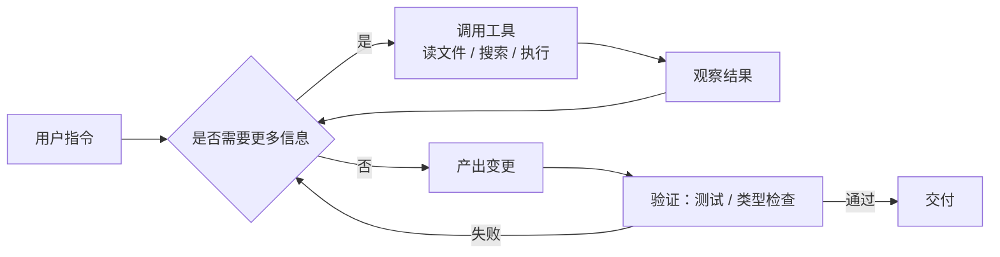

# 配图体系：怎么做出好看又讲得清楚的图

> 最后更新：2026-09-07
> 本专题的差异化在图。**图的第一职责是解释机制，第二职责才是好看。**

## 0. 三条原则

1. **一图一主张**。一张图只回答一个问题。塞不下就拆两张，不要缩字号。
2. **先能读懂，再谈美观**。层级 > 对齐 > 配色 > 质感，顺序不能反。
3. **源文件必须入库**。任何不能被下一个人修改的图，都是技术债。

---

## 1. 先选对图的类型

| 你想说明的事 | 该画的图 | 首选工具 |
| --- | --- | --- |
| Agent 的执行循环、决策分支 | 流程图 / 状态机 | Mermaid `flowchart` / `stateDiagram` |
| 多个角色/进程之间的交互顺序 | 时序图 | Mermaid `sequenceDiagram` |
| 系统分层、模块依赖 | 架构分层图 | D2 / Excalidraw |
| 上下文窗口被什么占满了 | 堆叠条形 / 占比图 | HTML+CSS 或 Vega-Lite |
| 两种做法的取舍 | 对比表 / 象限图 | 表格（够用就别画图）/ Mermaid `quadrantChart` |
| 能力或版本的演进 | 时间线 | Mermaid `timeline` |
| 抽象概念的直觉（如「上下文是预算」） | 隐喻手绘图 | Excalidraw / tldraw |
| 命令行操作实况 | 终端录屏 GIF | **VHS**（可复现，见 §4） |
| 代码片段的重点标注 | 代码图 | Carbon / Ray.so / Silicon |

> **反问自己**：这张图删掉，读者会看不懂吗？答案是「不会」的图，就是装饰图，删。

---

## 2. 工具链分层（从轻到重）

### L1 · Mermaid —— 默认选项，覆盖 70% 的图

理由：写在 Markdown 里、GitHub / 本仓库原生渲染、可 diff、可版本控制、改起来零成本。



要点：
- 用 `<br/>` 换行控制节点宽度，别让文字撑爆布局。
- 复杂图用 `subgraph` 分组，比硬连线清晰得多。
- 配色用 `classDef` 统一定义，不要逐节点写样式：

```
classDef primary fill:#2563EB,stroke:#1E40AF,color:#fff
classDef muted   fill:#F1F5F9,stroke:#CBD5E1,color:#0F172A
class P,V primary
class T,O muted
```

**批量导出 SVG** —— 本仓库已封装成脚本：

```bash
npm i -g @mermaid-js/mermaid-cli
make diagrams          # = bash scripts/render-diagrams.sh
```

脚本会读 `assets/diagrams/_puppeteer.json` 指定 Chromium 路径（无头环境必需），
把 `assets/diagrams/*.mmd` 全部渲染成透明底 SVG。

`-b transparent` 很关键：透明底才能同时适配亮色和暗色页面。

### L2 · D2 / Graphviz / PlantUML —— 结构复杂时

Mermaid 布局失控（连线打结、层级超过 4 层）时换 D2。D2 的自动布局和主题更强，语法也更接近「写结构」而非「写图」。

```d2
claude_code: Claude Code CLI {
  context: 上下文装配
  tools: 工具执行
}
mcp: MCP Server
claude_code.tools -> mcp: stdio / http
```

```bash
d2 --theme 300 --dark-theme 200 diagram.d2 diagram.svg   # 一次导出双主题
```

### L3 · Excalidraw / tldraw —— 概念图与手绘感

适合封面、隐喻图、白板式的「思路推演」。手绘风格能天然传递「这是示意，不是精确规格」。

- 存 `.excalidraw` 源文件，导出时**勾选 “Embed scene”** 的 SVG，这样 SVG 本身就能拖回编辑器继续改。
- 建一个 `assets/diagrams/_library.excalidraw` 放常用元件（Agent 图标、终端框、文件卡片），保证跨图一致。

### L4 · HTML + CSS + Playwright —— 需要像素级控制时

数据图、对比卡片、带真实字体排版的图，用网页画然后截图，比设计工具更可控、可批量、可复现。

本仓库已有一个更轻的实现：`scripts/render-frames.sh` 直接调用 Chromium 的
`--screenshot`，不装 Playwright 也能出图（见 `assets/diagrams/src/clip-01.html`）。
需要更复杂的交互时再上 Playwright：

```js
// scripts/shoot.mjs
import { chromium } from 'playwright';
const b = await chromium.launch();
const p = await b.newPage({ viewportSize: { width: 1200, height: 630 },
                            deviceScaleFactor: 2 });          // 2x 高清
await p.goto('file://' + process.cwd() + '/assets/src/context-budget.html');
await p.screenshot({ path: 'assets/diagrams/context-budget.png' });
await b.close();
```

同一份 HTML 加 `?theme=dark` 就能出暗色版本，一份源文件两套产物。

### L5 · Figma —— 只用于封面和成册排版

不要用 Figma 画会频繁修改的技术图，改一次的成本太高。它只负责 M4 阶段的封面、海报、PDF 排版。

---

## 3. 视觉规范（全专题统一）

### 配色令牌

```
--ink        #0F172A   主文字 / 主线条
--muted      #64748B   次级文字
--line       #CBD5E1   分隔线 / 弱连线
--surface    #F8FAFC   容器底
--primary    #2563EB   主强调（主流程、正确路径）
--accent     #7C3AED   次强调（分支、可选项）
--warn       #D97706   注意 / 有代价的路径
--danger     #DC2626   错误 / 反模式
--ok         #059669   成功 / 验证通过
```

规矩：
- **一张图最多 3 个强调色**，其余全用中性色。颜色多 = 没有重点。
- **不靠颜色单独表意**：红色路径同时加虚线或 ✗ 图标，色盲用户和黑白打印都要能读。
- 文字与背景对比度 ≥ 4.5:1。

### 字体 / 线条 / 间距

- 中文用 Noto Sans SC / 思源黑体，英文与代码用 JetBrains Mono 或 SF Mono。**图里的代码必须用等宽字体。**
- 字号层级只用三档：标题 20px / 正文 14px / 注释 12px（按 1200px 宽画布计）。
- 线宽两档：主流程 2px，次要 1px。圆角统一 8px。
- 节点内边距 ≥ 12px，节点间距 ≥ 24px。**留白比加内容更能提升可读性。**

### 暗色模式

- SVG 导出用透明背景，文字颜色不要写死纯黑，用 `#0F172A` 这类深蓝灰在暗底上也不至于完全糊。
- 真要做双版本，就走 L4（HTML 加 `?theme=dark`）或 D2 的 `--dark-theme`，命名为 `name.svg` / `name-dark.svg`，在 Markdown 里用 `<picture>` 切换：

```html
<picture>
  <source media="(prefers-color-scheme: dark)" srcset="agent-loop-dark.svg">
  
</picture>
```

### 可访问性

- 每张图必须有 `alt`，写**图在说什么**，不是「一张流程图」。
- 关键信息不能只存在于图里，正文要有文字复述。

---

## 4. 终端演示：用 VHS，不要手工录屏

手工录屏无法复现、无法修改、还容易录进敏感信息。[VHS](https://github.com/charmbracelet/vhs) 用脚本生成终端 GIF：

```tape
# assets/diagrams/plan-mode.tape
Output assets/diagrams/plan-mode.gif
Set FontSize 20
Set Width 1200
Set Height 700
Set Theme "Catppuccin Mocha"
Set TypingSpeed 40ms

Type "claude"
Enter
Sleep 2s
Type "帮我重构 auth 模块，先给方案"
Enter
Sleep 8s
```

```bash
vhs assets/diagrams/plan-mode.tape
```

好处：改一行文案就能重新生成；`.tape` 是纯文本可 review；不会误录 token。
真实截图无可替代时（IDE 界面），**截图前务必换到一个干净的演示仓库和演示账号**。

---

## 5. 生产流程


### 命名与存放

```
assets/diagrams/
  agent-loop.mmd            # 源文件
  agent-loop.svg            # 导出
  agent-loop-dark.svg       # 暗色版（如需要）
  context-budget.html       # L4 源文件
  context-budget.png
  plan-mode.tape            # VHS 脚本
  plan-mode.gif
```

命名规则：`<主题>-<细分>.<ext>`，全小写、连字符分隔、不带日期不带 v2。版本交给 git。

### 建议的自动化（M2 阶段再上）

CI 里加一步：检测 `assets/diagrams/*.mmd` 变更就自动跑 `mmdc` 重新导出并提交，避免源文件和产物不同步。

---

## 6. 反模式

| ❌ 别这样 | ✅ 改成 |
| --- | --- |
| 一张图画完整个系统 | 拆成「总览图 + 若干细节图」 |
| 图里塞大段说明文字 | 文字放正文，图里只留标签 |
| 每张图配色都不一样 | 用 §3 的令牌，全专题统一 |
| 截图带着真实 token / 内部仓库名 | 用演示仓库 + 演示账号，发布前放大检查一遍 |
| 只提交 PNG，源文件在本地 | 源文件必须入库 |
| 用 AI 生成插画当技术图 | 技术图必须准确；AI 生图只用于封面氛围 |
| 深色截图配浅色文章（或反之） | 统一图的背景基调，或做双主题 |
