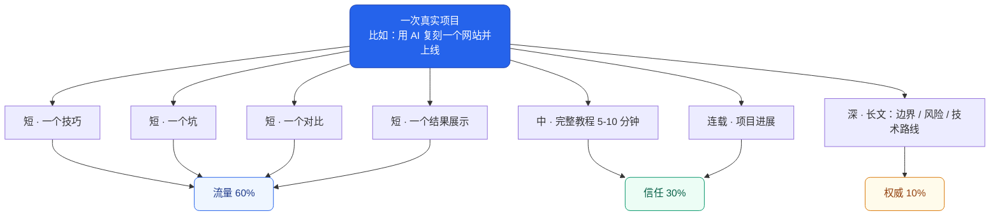

# 内容策略：怎么让内容既有人看，又有人信

> 最后更新：2026-09-07 ｜ 这份文档决定**写什么**，[`00-plan.md`](00-plan.md) 决定**做到什么程度**

---

## 0. 一句话策略

> **简单内容负责让陌生人看到你，深度内容负责让看到你的人相信你，真实项目负责让相信你的人最终付费。**

---

## 1. 我们之前错在哪

M0 阶段定的 24 篇大纲，全部是「讲一个概念」型的：
《编码 Agent 到底在循环什么》《上下文窗口是预算》《MCP 是什么》……

按下面的三档分类，**24 篇里有 22 篇属于「权威内容」——那一档本来只该占 10%。**

内容质量没问题，问题是**没有入口**。没人搜「上下文工程」，
大家搜的是「claude code 怎么做网站」。

所以这次调整的核心不是降低质量，而是**补上前面两档**。

---

## 2. 三档内容，6 : 3 : 1

| 档位 | 占比 | 目标 | 判断标准 |
| --- | --- | --- | --- |
| **流量内容** | 60% | 让陌生人看到 | 标题里有**具体结果**或**明确对比** |
| **信任内容** | 30% | 让人觉得"这人真做过" | 有**完整过程**，包括失败的部分 |
| **权威内容** | 10% | 长期可查、建立品牌 | 半年后还有人搜到并收藏 |

### 2.1 流量内容长什么样

特征：热点 / 对比 / 结果展示 / 反常识 / 一个明确技巧。

```
✅ Claude Code 最容易被忽略的 3 个功能
✅ 同样做一个网站，Codex 和 Claude Code 谁更强？
✅ AI 做的网站为什么一眼就很廉价？问题不在模型
✅ 这个开源项目能让 5 个 Agent 一起写网页
```

### 2.2 信任内容长什么样

特征：实测 / 完整教程 / 工作流 / 项目复盘 / 失败原因。

```
✅ 从需求到上线，我怎样用 AI 给客户做一个网站
✅ Claude Code + git worktree 多 Agent 实战
✅ Vercel + Supabase 项目上线全过程（含踩坑）
```

**这一档必须包含失败过程。** 全程顺利的教程没有可信度。

### 2.3 权威内容长什么样

特征：系统化、原理、长指南、可反复查阅。

```
✅ AI Agent 从入门到实践完整指南
✅ Codex / Claude Code / Cursor 的架构与使用边界
✅ AI 编程工具的权限、安全与成本分析
```

> 我们已有的 `references/` 官方文档镜像、配图工具链、双版本制度，
> 就是为这一档准备的基础设施。它们不废弃，只是从主角变成后盾。

---

## 3. 四类最受欢迎的内容，我们怎么接

大众关心的从来不是「AI 是什么」，而是这四件事：

| 大众在问 | 我们对应做什么 |
| --- | --- |
| **AI 能帮我做什么** | 项目成果展示：一个能打开的网站、一个能用的工具 |
| **一个具体任务怎么完成** | 完整教程，从零到上线，命令可复制 |
| **几个工具到底哪个好** | 同一任务横评：同样的 prompt，比过程、比失败、比成本 |
| **AI 会不会影响我的工作** | 严格限量，且必须配数据和实测（见 §7 负面清单） |

### 横评的正确做法

**别列功能表。** 功能表谁都能抄。有价值的横评长这样：

1. 交代这几个工具分别适合谁
2. 给**同一个真实任务**
3. 展示完整提示词和配置
4. 记录**耗时**和**费用**
5. **展示失败的地方**
6. 对比最终结果
7. 给一句明确的购买建议

第 4 和第 5 条是别人不愿意做的，也是我们的差异点。

---

## 4. 核心机制：一次实验，七条内容

这是整个策略能不能跑起来的关键。

**不要为每条内容单独选题。** 一个人扛不住。
正确的做法是：**做一个真实项目，然后从这一个项目里拆出七条内容。**



**调研只做一次，内容出七条。** 这是唯一可持续的产能模型。

### 一个具体例子

母实验：**用 AI 复刻一个网站截图并部署上线**

| # | 类型 | 标题 | 素材来自实验的哪一步 |
| --- | --- | --- | --- |
| 1 | 短 | AI 做的网站为什么一眼就很廉价？问题不在模型 | 第一版产出的失败截图 |
| 2 | 短 | 让 AI 复刻网页，这一步 90% 的人漏了 | 喂设计参考的那步 |
| 3 | 短 | 三个 AI 复刻同一张截图，差距有多大 | 三个工具的并列结果 |
| 4 | 短 | 2 小时，从一张截图到上线 | 最终成品 + 计时 |
| 5 | 中 | 完整教程：截图 → 可部署网站 | 全流程录屏 |
| 6 | 深 | 网站复刻的边界：版权风险、技术路线、改造方法 | 调研 + 判断 |
| 7 | 连载 | 项目第 1 周：做了什么、卡在哪 | 过程记录 |

**七条内容，一次实验。**

---

## 5. 五个标题公式

写不出标题的时候，往里面套。

| 公式 | 结构 | 例子 |
| --- | --- | --- |
| **① 热点 + 场景 + 结果** | 新工具 + 普通人任务 + 明确产出 | Gemini 新功能太离谱，10 分钟做完一份汇报 |
| **② 两工具 + 同任务 + 胜负** | A vs B 做同一件事 | 同样做一个网站，Codex 和 Claude Code 谁更强？ |
| **③ 痛点 + 意外原因 + 解法** | 你以为是 X，其实是 Y | AI 做的网站为什么一眼很廉价？问题不在模型 |
| **④ 挑战 + 时限 + 作品** | 限制条件下能不能做成 | 不写代码，只用 AI，24 小时能不能上线一个网站？ |
| **⑤ 争议判断 + 实测** | 一个有人反对的结论 + 证据 | AI 做网站已经这么强，客户为什么还愿意付钱？ |

**标题里必须出现下面至少一个**：具体数字、具体产物、明确对比、反常识结论。

三个都没有的标题，重写。

---

## 6. 简单内容 vs 深度内容

**区别不是字数，是读者看完得到了什么。**

| | 简单内容 | 深度内容 |
| --- | --- | --- |
| 目标 | 让人**快速知道** | 让人**真正掌握** |
| 读者 | 普通人、新手 | 从业者、进阶 |
| 篇幅 | 30 秒 - 3 分钟 | 8 - 30 分钟 |
| 选题 | 一个结论、一个技巧 | 一个完整问题 |
| 表达 | 结论优先 | 证据、过程、边界 |
| 优势 | 曝光快、涨粉快 | 信任高、转化高 |
| 弱点 | 容易同质化 | 制作慢 |
| 变现 | 广告、带货 | 课程、咨询、服务 |

### 简单 ≠ 肤浅

一条好的短内容**只解决一个问题**，结构固定：

```
1. 先给结论
2. 展示操作
3. 提醒一个坑
4. 引导看完整教程
```

例：《Claude Code 可以同时开两个项目吗？》——能，怎么开，注意什么，详见长教程。

### 深度 ≠ 堆概念

真正的深度要回答六个问题：

1. 为什么有效
2. 在什么条件下有效
3. 什么时候会失败
4. 成本是多少
5. 有没有替代方案
6. 读者怎么复现

**六个都答了，才是资产型内容**——半年后还有人搜到、收藏、反复看。

---

## 7. 负面清单：不做什么

| ❌ 不做 | 原因 |
| --- | --- |
| **每天介绍一个 AI 工具** | 门槛低、替代性强，工具过时内容就废 |
| **纯焦虑选题**（AI 取代程序员、失业、暴富） | 吸引来的是看热闹的，不是学东西的 |
| **只列功能表的横评** | 官网就有，没有增量 |
| **没有失败过程的教程** | 不可信 |
| **搬运官方 changelog** | 没有一手信息就不发 |
| **标题里没有具体结果的选题** | 点不开 |

### 焦虑类内容的硬上限

**每月最多 1 条，且必须满足三条**：

1. 有数据或实测支撑，不是纯观点
2. 结论落在「普通人现在该做什么」，不是「完蛋了」
3. 标题不用「取代」「淘汰」「危险」这类词

反面：*AI 会淘汰前端程序员*
正面：*我用 AI 连续开发 7 天，发现前端工作里最先被替代的是这三个环节*

---

## 8. 平台分发

同一次实验，不同平台切不同的口。

| 平台 | 主要形态 | 切哪一段 |
| --- | --- | --- |
| **B站** | 中长视频 8-20 分钟 | 完整教程 + 失败过程 |
| **YouTube** | 8-15 分钟，英文 | 同上，重制 |
| **抖音 / 小红书** | 30-60 秒竖屏 | 结果展示 + 一个坑 |
| **公众号 / 知乎** | 长文 | 深度长文 + 可复制配置 |
| **X** | 图 + 三句话 | 反常识结论 |
| **本仓库 / 博客** | 全部 | 母版，其他平台都往这里引流 |

**发布顺序**：长文先发（沉淀搜索）→ 视频次之（简介引流回长文）→ 短内容最后（引流到视频）。

---

## 9. 一份关于趋势判断的说明

本策略里「大众关注点从『AI 是什么』转向『AI 怎么帮我』」这一判断，
来自外部资料（Google Trends 的 AI 搜索整理、B站 AI 内容分类、
YouTube 2025 创作者趋势报告）。

**这些来源本仓库尚未逐一核实。** 按 [`01-sources.md`](01-sources.md) 的引用规范，
在正式文章里引用前需要补齐原始链接和访问日期。

不过这个判断**不需要靠外部报告成立**：
我们自己发布几条后看数据，一周内就能验证。**以我们自己的数据为准。**
