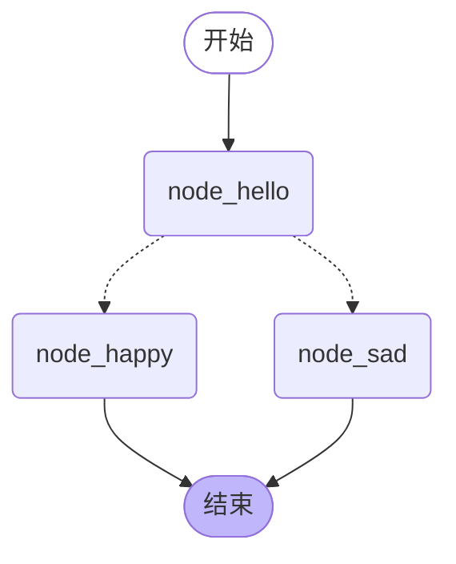

# 程序怎么按一张图往下走：状态、节点和条件边

> **导读：** 大模型就是 ChatGPT、DeepSeek 那类会聊天的程序。让代码问它一句话不难，
> 难的是让程序在它答完之后自己决定下一步干什么。这一讲把这件事画成一张流程图：
> 一份大家共用的数据、几个只管干活的小步骤、一个专门决定往哪拐的岔路口。
> 读完你能画出一张会分叉的流程，并说清那个岔路口是谁在做决定。

上一讲你已经让代码跟大模型说上了话——大模型就是 ChatGPT、DeepSeek 那类会聊天的程序。

但那是一问一答：你问一句，它答一句，然后就结束了。
**它不会在中间拐弯，更不会根据答上来的内容决定下一步做什么。**

这一讲就把「拐弯」这件事交出去——交给一张事先画好的图。
**这里说的「图」不是图片**，指的是一张写着「先做哪一步、什么情况下走哪条路」的流程表，
跟你在纸上画的办事流程是一回事。

## 先把这张图跑起来

**确认终端里那行字前面有 `(.venv)`**，没有就先激活环境（[怎么装、怎么激活](../课程总纲/README.md)）。

```
python 课程代码/lessons/lesson02_simple_graph.py
```

前两段输出长这样：

```
== 第一次：输入里带「开心」==
--- 走到 node_hello ---
--- 走到 node_happy ---
{'text': '我想开心一点 你好，今天很开心！'}

== 第二次：输入里不带「开心」==
--- 走到 node_hello ---
--- 走到 node_sad ---
{'text': '随便说点什么 你好，今天有点累。'}
```

**同一张图，跑了两次，走了两条不同的路。** 这就是这一讲要讲清楚的全部事情。

下面把这段代码拆开，一次讲一块。

---

## 状态：一份大家都能看、都能改的共享数据

先声明这张图里流动的是什么数据：

```python
from typing_extensions import TypedDict

class State(TypedDict):
    text: str
```

这段话在说：**这张图从头到尾只有一份数据，里面有一个格子叫 `text`，装的是文字。**

它的学名叫**状态**。别把它想成「函数的参数」，想成**一块所有人都能看、都能改的白板**。
第一步在上面写字，第二步能读到第一步写的，改完第三步又能读到。

`TypedDict` 是 Python 自带的写法，作用是**提前说清楚这块白板上有哪些格子、每个格子装什么**。
写清楚了，你后面拼错字段名时编辑器会直接标红，不用等到跑起来才发现。

---

## 节点：就是普通函数，没有任何特殊之处

```python
def node_hello(state: State) -> dict:
    print("--- 走到 node_hello ---")
    return {"text": state["text"] + " 你好"}
```

**节点**就是一个普通的 Python 函数。两条规矩，记死：

**第一，它收到的是整块白板。** 参数 `state` 就是当前这份共享数据，`state["text"]` 读出格子里的内容。

**第二，它返回的是「要改哪几个格子」，不是整块白板。** 上面这个函数只返回了 `text`，
如果白板上还有别的格子，那些格子原样不动。

这条规矩很省事：**一个节点只管自己那摊事，不用关心白板上其他部分。**

### 一个必须先知道的默认行为

**默认情况下，节点返回什么，格子里就变成什么——后写的盖掉先写的。**

脚本里演示了这一点。两个节点先后写同一个格子：

```python
def node_append(state):
    return {"text": state["text"] + " 我读了旧值再接上"}

def node_overwrite(state):
    return {"text": "我没读旧值"}
```

从「原始内容」开始，跑完是：

```
{'text': '我没读旧值'}
```

**前面两步写的东西全没了。** 第一个节点读了旧值再接上去，所以看起来像「追加」；
但那是它自己手动接的。第二个节点没读旧值，直接返回一个新值，**旧值就被顶掉了**。

**所以呢？** 意味着你要是指望「每个节点各写一条、最后攒成一个列表」，
按上面这种写法是攒不起来的——你只会拿到最后一条。

**怎么让它变成「合并」而不是「覆盖」，是第 10 讲的事。** 这一讲你只要记住默认是覆盖。

---

## 边：连线。想拐弯就用条件边

**边**就是连线，规定走完这一步去哪一步。

普通的边是写死的：走完 A 一定去 B。想让它拐弯，就得用**条件边**——
一个只负责回答「下一步去哪」的函数：

```python
from typing import Literal

def route(state: State) -> Literal["node_happy", "node_sad"]:
    return "node_happy" if "开心" in state["text"] else "node_sad"
```

**这里是全讲最容易搞混的一处：这个函数返回的是下一个节点的名字，不是数据。**

它不改白板，只做决定。改白板是节点的活，做决定是它的活，**这两件事在这里是分开的**。

`Literal["node_happy", "node_sad"]` 是在说「这个函数只会返回这两个名字之一」。
写不写都能跑，但写了有两个好处：编辑器能帮你查拼写，画图时也能标出这两条可能的路。

### 打个比方

一张图就是**流水线上的工位表**。

白板是传送带上那个箱子，谁都能往里放东西。节点是工位上的师傅，
拿箱子、放东西、传下去。条件边是质检员，**他不动箱子，只喊往左还是往右**。

**换句话说：改数据的和决定走向的，在这里是两种不同的函数。**

---

## 组装：四步，顺序固定

```python
from langgraph.graph import END, START, StateGraph

builder = StateGraph(State)                          # ① 声明白板长什么样
builder.add_node("node_hello", node_hello)           # ② 加节点，给它起个名字
builder.add_node("node_happy", node_happy)
builder.add_node("node_sad", node_sad)

builder.add_edge(START, "node_hello")                # ③ 连边
builder.add_conditional_edges("node_hello", route)   #    岔路用这个
builder.add_edge("node_happy", END)
builder.add_edge("node_sad", END)

graph = builder.compile()                            # ④ 编译成能跑的图
```

`START` 和 `END` 是两个内置的特殊位置，代表整张图的入口和出口。

`add_node` 里那个字符串是**节点的名字**。它很重要——刚才那个岔路函数返回的
就是这个名字，两处必须对得上。**对不上会在编译时报错**，不会等到跑起来才炸。

编译这一步在做检查：有没有连到不存在的节点、有没有节点谁都到不了。
**检查过了才给你一个能跑的图。**

---

## 这张图长什么样

图的结构可以直接从程序里导出来，不用手画：

```python
print(graph.get_graph().draw_mermaid())
```

真实输出画出来是这样：



**注意实线和虚线的区别：实线是写死的边，虚线是条件边。**
从 `node_hello` 出去的两条都是虚线，因为走哪条要到跑起来才知道。

---

## 动手：让这张图告诉你它走了几步

改三个地方，让白板上多一个计数器：

**第一处**，白板上加一个格子：

```python
class State(TypedDict):
    text: str
    count: int          # 加这行
```

**第二处**，每个节点都给它加一：

```python
def node_hello(state: State) -> dict:
    print("--- 走到 node_hello ---")
    return {"text": state["text"] + " 你好", "count": state["count"] + 1}
```

`node_happy` 和 `node_sad` 同样处理。**三个节点都要改，漏一个数字就不对。**

**第三处**，调用时给个初始值：

```python
graph.invoke({"text": "我想开心一点", "count": 0})
```

**验收标准：`count` 跑出来是 2。**

为什么是 2 不是 3？因为条件边只让它走了 `node_hello` 和 `node_happy` 两个节点，
第三个节点这次根本没走到。**这个数字本身就在告诉你条件边确实起了作用。**

跑出 2，这一讲的核心你就拿到了。

### 再做一个：故意把它连成死循环

把 `node_happy` 的下一步从 `END` 改成回到 `node_hello`：

```python
builder.add_edge("node_happy", "node_hello")
```

跑起来会一直转，最后抛出一个说「递归上限」的错。

**这不是 bug，是保护。** 图允许你连成环——**后面的 agent 能反复思考，靠的正是这种环，
而不是 for 循环**。既然允许成环，就必须有个上限兜底，否则一个写错的条件边能让程序转到天荒地老。

上限具体是多少、怎么调，第 06 讲用得上时再说。

---

## 两个会改变结果的细节

**第一，节点名和岔路函数的返回值必须严格一致。**
`"node_happy"` 写成 `"node-happy"` 会在编译时报错。这是好事——**错在编译时暴露，
比跑到一半才炸好得多。**

**第二，本讲代码在 Python 3.11 与 langgraph 1.2.x 上跑通。**
网上 2024 年的写法很多已经不适用，照抄容易卡在导入这一步。

---

## 这一讲得到了什么，下一讲接着讲什么

你现在能写出一张会分叉的图了：**白板装数据，节点改数据，条件边决定走向，编译后就能跑。**
同一张图喂不同的输入，它会走不同的路——这是「一问一答」做不到的。

但你有没有注意到，这张图里流的是 `{"text": "..."}` 这样一个普通字典。
**真正的对话不长这样。** 对话是一串消息，有你说的、有模型答的、有系统设定的，
一轮一轮往后接。**你没法把一串会不断变长的对话，塞进一个只会被覆盖的格子里。**

下一讲就解决这件事：**怎么让白板装得下一整段会不断变长的对话。**
