> 适用版本：Claude Code v2.x ｜ 验证日期：2026-09-07
> 阅读门槛：会写代码就行，不需要用过 Claude Code

---

## 一、先看一个你八成遇到过的场景

你打开 Claude Code（或者 Codex、Cursor，都一样），说：

```text
把登录模块重构一下
```

然后你就开始看着屏幕。它读文件、改代码、又读文件。

十分钟后，它说：**「已完成。」**

你打开 diff 一看——漏了一个分支。你告诉它，它改了。
再一看，又漏了另一个。你再告诉它。

半小时过去，你比自己动手写还累。

**这篇文章想说的是：这件事不怪它笨，而且是可以避免的。**

---

## 二、你其实是被拉进了它的工作流程

上面那个过程里，有一个环节一直是你在做：**判断它做得对不对。**

它改完 → 你看 → 你说不对 → 它再改 → 你再看……

这个来回就是你累的原因。而这个环节，**本来可以交给机器**。

要理解为什么能交出去，得先知道它到底是怎么干活的。往下看。

> **小结**：累的不是"它改代码"，是"你一直在验收"。

---

## 三、它和"聊天机器人"不是一回事

这一点很多人一开始没转过弯来，先说清楚。

| | 聊天机器人（比如网页版对话） | 编码 Agent（比如 Claude Code） |
| --- | --- | --- |
| 它能做什么 | 只能输出文字 | 能真的读你的文件、改你的文件、在你电脑上跑命令 |
| 你要做什么 | 复制它给的代码，自己粘贴进项目 | 基本不用粘贴，它自己动手 |
| 停下来的时机 | 说完一段话就停 | **它觉得任务做完了才停** |

最后一行是重点。

**它不是"回答完一个问题就结束"，而是"一直干到它认为做完为止"。**

"Agent"这个词翻译过来叫「智能体」，但它的实际含义很朴素：
**能自己决定下一步做什么、并且真的去做的程序。**

> **小结**：它是个会自己干活的程序，不是个会说话的程序。

---

## 四、它干活其实就三步，来回转圈

Claude Code 的官方文档把它的工作过程拆成三个阶段：

**① 收集上下文 → ② 采取行动 → ③ 验证结果**

英文原文是 gather context → take action → verify results。
「上下文」（context）这个词后面还会反复出现，你现在就理解成
**"它为了干这个活，需要知道的所有信息"** 就够了。

这三步不是走一遍就完，而是**转圈**：第三步没过，就回到第一步再来。



下面一步步说。

---

### 4.1 第一步：找资料

它要先搞清楚"现状是什么"。

具体动作就是：搜文件名、用关键词搜内容、把相关文件读进来、必要时上网查文档。

**这一步它做多少，取决于你说得多具体。** 你说"重构登录模块"，
它得自己去找登录模块在哪；你说"重构 `src/auth/login.ts`"，它直接就读了。

### 4.2 第二步：动手改

搞清楚现状之后，它开始动手：编辑文件、新建文件、执行命令（比如装个依赖、跑个脚本）。

**注意：这一步是真的在改你的磁盘。** 不是给你一段代码让你自己贴。

### 4.3 第三步：检查

改完之后，它会试着确认一下有没有改对——比如跑一下测试、看看构建过不过。

**但这一步有个前提：得有东西可跑。**

如果你的项目没测试、或者你没告诉它该跑什么，
那这一步它就……跳过了。

**这就是所有问题的根源。** 下一节展开。

---

## 五、关键问题：它凭什么觉得"干完了"？

官方文档里有一句话，说得非常直白：

> Claude stops when the work looks done.
> （工作**看起来**做完了，它就停。）

注意是 **looks done**——"看起来"。

如果它手上有一个能跑的检查（比如一套测试），
那"做完了"的判断依据就是**测试过了**，这是个硬信号。

如果它手上什么都没有，那"做完了"的判断依据就只剩下……
**它自己觉得差不多了。**

而"它自己觉得差不多了"，准确率显然不高。

> **小结**：有检查，"做完"是客观的；没检查，"做完"是它猜的。

---

## 六、没有检查的时候，检查的人就是你

官方文档紧接着那句话说：

> Without a check it can run, "looks done" is the only signal available,
> and **you become the verification loop**: every mistake waits for you to notice it.
> —— [Claude Code Docs · Best practices](https://code.claude.com/docs/en/best-practices)（访问于 2026-09-07）

翻译过来就是：

**你没给它一个能自己跑的检查，那个负责检查的人就是你。
每一个错误，都得等你发现。**

回头看第一节那个场景——你半小时干的事，就是"人肉测试"。



左右两边的区别，不是它变聪明了，而是**"谁来判断做完没做完"换人了**。

---

## 七、打个比方：像带一个新来的实习生

假设你带一个刚入职的实习生，能力不错，但不了解你们项目。

**情况 A**：你说"把登录模块重构一下"，然后就不管了。
他改完跑来问你"这样行吗"。你看一眼，说这里不对。他改完又来问。
——你成了他的编译器。

**情况 B**：你说"把登录模块重构一下，改完把 `npm test` 跑一遍，全绿了再来找我"。
他改完自己跑测试，红了自己看报错、自己改，直到全绿才来找你。
——你只需要看最后的结果。

**同一个实习生，同一个任务，你的工作量差了好几倍。**

差别只在于：**你有没有告诉他"什么叫做完了"。**

Agent 完全一样。

> **小结**：它不缺能力，缺的是"验收标准"。

---

## 八、那怎么办？把验收标准直接写进去

方法特别简单，就是**在提示词里多加一句话**，告诉它"做完之后跑什么"。

先看最小的例子：

**改之前：**
```text
实现一个校验邮箱的函数
```

**改之后：**
```text
写 validateEmail 函数。
用例：a@b.com 通过，invalid 不通过，a@.com 不通过。
实现完把测试跑一遍。
```

就多了两行。但发生的事情完全变了：

| | 改之前 | 改之后 |
| --- | --- | --- |
| 谁在验证 | 你 | 它自己 |
| 什么时候发现错误 | 你读代码的时候 | 它跑测试的时候 |
| 你要做什么 | 读代码、找漏洞、写反馈、等它改 | 看它贴出来的测试结果 |
| 你能不能去干别的 | 不能 | 能 |

---

## 九、三个照抄就能用的改写例子

不只是写函数能这么干。官方文档给了三类：

**① 写新功能——把测试用例直接给它**

```text
❌ 实现一个校验邮箱的函数

✅ 写 validateEmail 函数。用例：a@b.com 通过，invalid 不通过，
   a@.com 不通过。实现完把测试跑一遍。
```

**② 改界面——让它自己截图对比**

```text
❌ 让仪表盘好看点

✅ [贴设计稿] 按这个设计实现。
   做完截个图和原设计对比，把差异列出来然后修掉。
```

**③ 修 bug——把报错贴给它，并且要求解决根因**

```text
❌ 构建挂了，修一下

✅ 构建报这个错：[贴完整错误]
   修好并且验证构建能过。
   要解决根本原因，不要用忽略/跳过的方式把错误压下去。
```

第三条最后那句"不要压制错误"很重要。
不加这句，它有可能给你加个 `try/catch` 把错误吞掉——
**构建确实过了，但问题还在。**

---

## 十、一个万能填空模板

不知道怎么写的时候，照这个填：

```text
【要做什么】

【它需要知道的背景 / 相关代码在哪】

做完之后跑 【什么命令】，
确认 【什么条件算通过】。
没过就继续改，直到过为止。
把跑的结果贴给我。
```

举个填好的例子：

```text
购物车在优惠券叠加的时候算错总价。

相关代码在 src/cart/ 下，测试在 tests/cart.spec.ts。

做完之后跑 npm test -- cart，
确认所有 cart 相关用例全绿。
没过就继续改，直到过为止。
把跑的结果贴给我。
```

**如果你的项目现在还没有测试**，最低限度也可以写：

```text
做完之后跑一遍 npm run build 和 npm run lint，确认都没报错。
```

有总比没有强。

---

## 十一、它说"做完了"，别信，要证据

还有一个小习惯，成本极低但很值：

**要求它把证据贴出来。**

不要接受"已完成"这三个字。要它给：
- 跑了什么命令
- 命令返回了什么
- 测试输出长什么样

官方原话：

> Have Claude show evidence rather than asserting success.
> （让它出示证据，而不是宣称成功。）

为什么这一条有用？因为**看一眼测试输出，比你自己把测试重跑一遍快得多**。
而且如果你中途走开了、没盯着它干活，回来一看证据就知道靠不靠谱。

> **小结**：它宣称成功不算数，它贴出通过的输出才算数。

---

## 十二、另外两个地方也能省不少事

前面讲的是**收尾**这一步。它的工作循环有三个阶段，另外两个阶段也各有一个技巧。



### 12.1 开头别说"你调研一下"

官方列的常见错误里有一条叫 **infinite exploration**（无限探索）：

你说"调研一下这块怎么实现的"，但没划范围。
于是它开始读文件，读了几百个，把"上下文"塞满了。

**上下文塞满会怎样？** 它能同时记住的信息是有上限的（这个上限叫上下文窗口）。
塞满之后，早期的信息会被挤掉或者压缩掉，它就开始忘事、开始胡说。

**修法**：给范围。

```text
❌ 调研一下我们的权限系统

✅ 我想知道权限校验在哪里做的。
   先只看 src/middleware/ 和 src/auth/ 这两个目录，
   给我一个 5 行以内的说明。
```

### 12.2 同一个问题纠正两次，就别纠第三次了

官方的说法是：

> 如果同一个问题你在一次会话里纠正了超过两次，
> 说明上下文里已经堆满了失败的尝试。

那些失败的尝试**不会消失**，它们一直在它的"记忆"里，
持续干扰后面的判断。你越纠正，它越乱。

**正确做法**：敲 `/clear` 清空重来，然后带着你刚学到的东西，
重新写一个更具体的提示词。

官方的判断是：**一个干净的会话配一个好提示词，
几乎总是打得过一个堆满纠正记录的长会话。**

顺便记两个键：
- `Esc`——中途打断它，但保留上下文，可以直接说"不对，往这边改"
- `Esc` 连按两下 / `/rewind`——回到之前某个时间点的对话和代码状态

**发现不对就立刻按 Esc，别等它跑完。**

---

## 十三、进阶：把检查从"提醒"升级成"门槛"

前面说的"在提示词里加一句"，是最简单的档次。
如果你想让它在你不看着的情况下也能干活，还有更硬的做法。

按投入从低到高排：

| 档次 | 做法 | 硬度 | 适合谁 |
| --- | --- | --- | --- |
| **1. 写进提示词** | "实现完把测试跑一遍" | 软，它可能忘 | **所有人，今天就能用** |
| **2. 设成会话目标** | 用 [`/goal`](https://code.claude.com/docs/en/goal) 设一个条件，每轮由一个独立的评估器复查 | 中 | 一次会话里的长任务 |
| **3. 设成结束门槛** | 用 [Stop hook](https://code.claude.com/docs/en/hooks) 挂一个脚本，脚本不通过就不许结束回合 | 硬，绕不过去 | 团队统一规矩 |
| **4. 找第二个人复核** | 用[子 Agent](https://code.claude.com/docs/en/sub-agents) 让另一个全新的模型去挑毛病 | 最硬 | 重要改动 |

**新手只用第 1 档就够了**，收益已经很大。后面三档等你用熟了再说。

第 4 档的思路值得单独提一句：**干活的人不应该是给自己打分的人。**
让一个不知道前因后果的新模型去"试着证明这个结果是错的"，
比让它自己复查自己有效得多。

---

## 十四、什么时候这套办法不管用

这一节很重要，别跳过。

**❌ 有测试 ≠ 有验证。**
如果测试根本覆盖不到它改的那部分代码，那个绿色的勾是假的。
你只是把瓶颈从"你的注意力"换成了"检查的质量"，**瓶颈没有消失**。

**❌ 验证不了的东西，就别合并。**
官方把这个坑叫 trust-then-verify gap：
它给你一个看起来特别合理、但边界情况全错的实现。
你验证不了，就不知道它错在哪。**那就不要合。**

**⚠️ 探索性的任务不适用。**
比如"这个模块大概怎么组织的"——这种任务本来就没有"通过/失败"，
硬造一个检查是白费劲。这类任务的重点在**开头划范围**（12.1 节），不在收尾。

**⚠️ "纠正两次就 clear"是经验，不是铁律。**
如果你正深陷一个复杂问题、而前面的对话历史本身很有价值，
让它继续累积是对的。官方自己也说这些都是起点，不是教条。

**❌ 别用"写了多少行"判断它干得好不好。**
唯一可靠的信号是：**那个检查过了没有，以及它贴出来的证据你认不认。**

---

## 十五、一页速查表

| 场景 | 你该做什么 |
| --- | --- |
| 要开始一个任务 | 说清楚做什么 + 相关代码在哪 + **做完跑什么命令** |
| 项目没有测试 | 退而求其次：让它跑 build 和 lint |
| 它说"已完成" | 要它贴出命令和输出，别直接信 |
| 它跑偏了 | 立刻 `Esc`，别等它跑完 |
| 同一个问题纠正两次还不对 | `/clear` 重开，重写提示词 |
| 想让它调研 | 划定目录范围 + 限定输出长度 |
| 改动很重要 | 让另一个子 Agent 复核 |
| 你验证不了它做了什么 | **不要合并** |

**一句话记住全文：**

> 你没给它一个能自己跑的检查，那个检查的人就是你。

---

## 十六、想继续深挖的话

- [How Claude Code works](https://code.claude.com/docs/en/how-claude-code-works) —— 三阶段循环讲得最全，还有它能用哪些工具
- [Best practices for Claude Code](https://code.claude.com/docs/en/best-practices) —— 「给它一个能验证的东西」是官方全文的第一节，另外有 5 个常见坑
- [Explore the context window](https://code.claude.com/docs/en/context-window) —— 上下文塞满之后到底发生了什么（下一篇讲这个）
- [Sub-agents](https://code.claude.com/docs/en/sub-agents) —— 子 Agent 怎么用

> 上面这些官方文档已经镜像在本仓库 [`references/anthropic-claude-code/`](../../references/anthropic-claude-code/) 里，
> 可以离线全文搜索，不用翻网页。

---

**下一篇预告**：它为什么聊着聊着就变笨了？——上下文窗口是个预算，不是个箱子。
