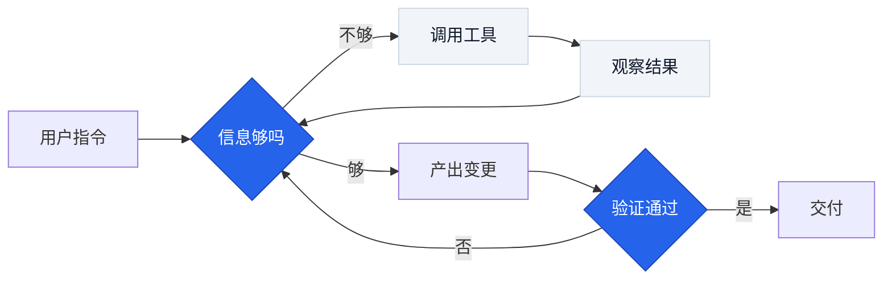
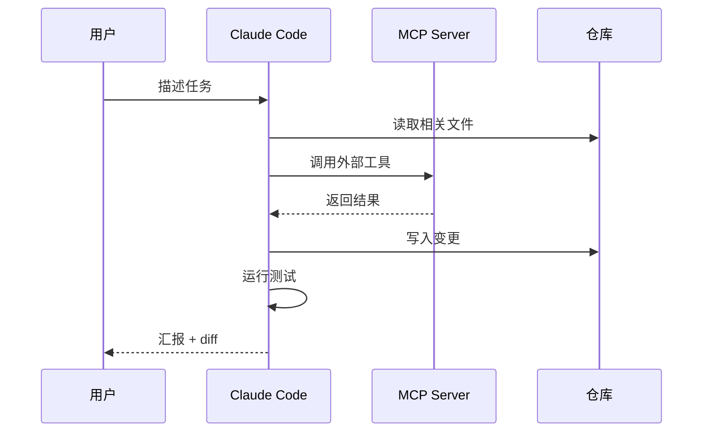
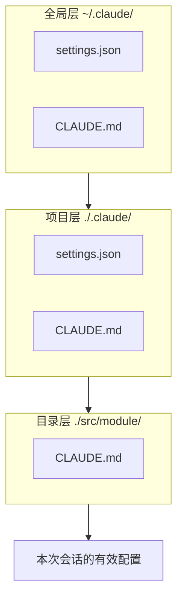
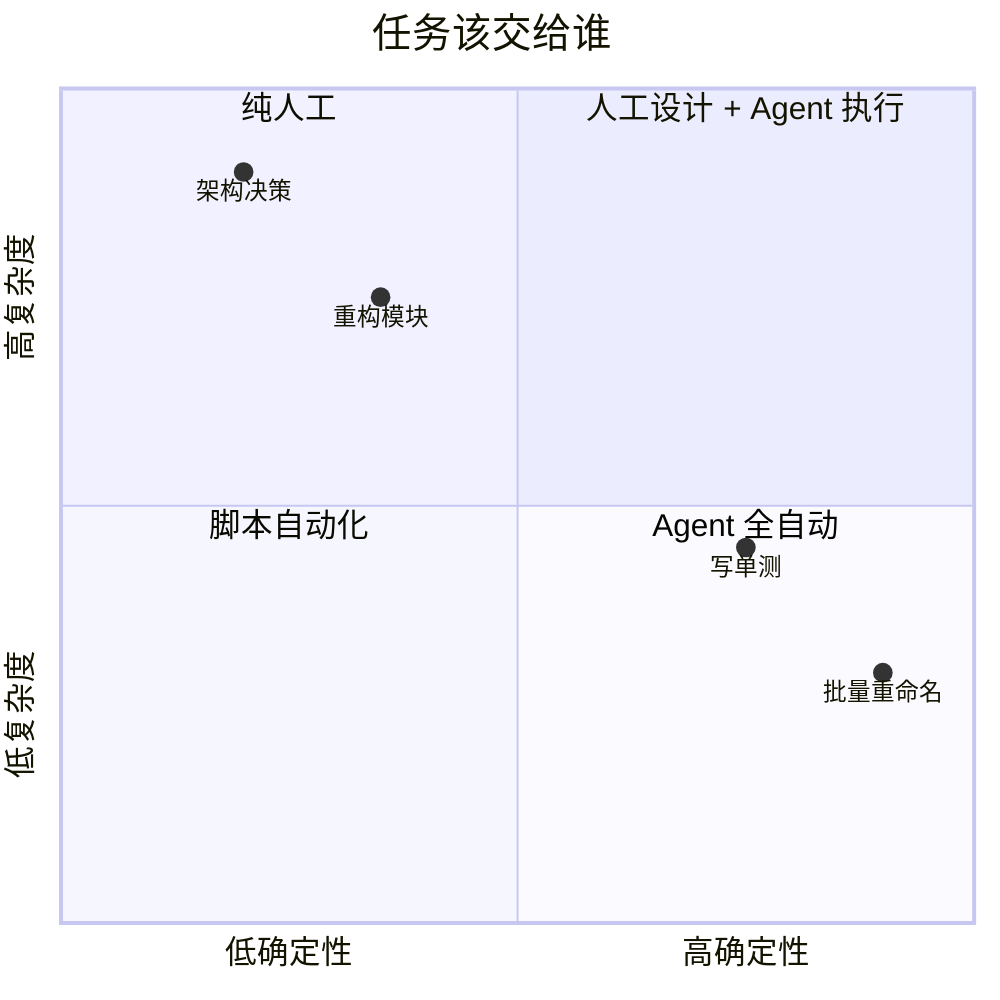
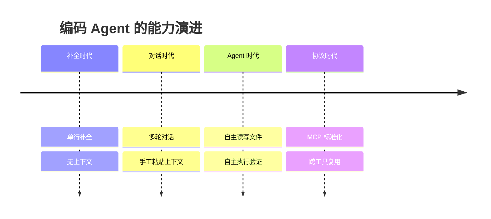

# 常用图表起手式

直接复制改。配色令牌见 `docs/02-visual-system.md` §3。

## 1. Agent 执行循环（flowchart）



## 2. 多方交互（sequenceDiagram）



## 3. 分层加载（flowchart + subgraph）



## 4. 取舍象限（quadrantChart）



## 5. 演进时间线（timeline）



## 6. 终端演示（VHS `.tape`）

```tape
Output assets/diagrams/demo.gif
Set FontSize 20
Set Width 1200
Set Height 700
Set Theme "Catppuccin Mocha"
Set TypingSpeed 40ms
Set Padding 24

Type "claude"
Enter
Sleep 2s
Type "先给我一个方案，别改代码"
Enter
Sleep 8s
```

## 7. HTML 数据图骨架（配 Playwright 截图）

```html
<!-- assets/diagrams/src/context-budget.html -->
<style>
  :root { --ink:#0F172A; --line:#CBD5E1; --primary:#2563EB; --warn:#D97706; }
  body { margin:0; width:1200px; height:630px; display:grid; place-items:center;
         font:14px/1.6 "Noto Sans SC", system-ui; color:var(--ink); background:#fff; }
  .bar { display:flex; width:900px; height:64px; border-radius:8px; overflow:hidden; }
  .seg { display:grid; place-items:center; color:#fff; font-size:12px; }
</style>
<div class="bar">
  <div class="seg" style="flex:3;background:var(--primary)">系统提示词</div>
  <div class="seg" style="flex:5;background:var(--warn)">MCP 工具定义</div>
  <div class="seg" style="flex:12;background:var(--ink)">对话历史</div>
  <div class="seg" style="flex:6;background:var(--line);color:var(--ink)">可用余量</div>
</div>
```
